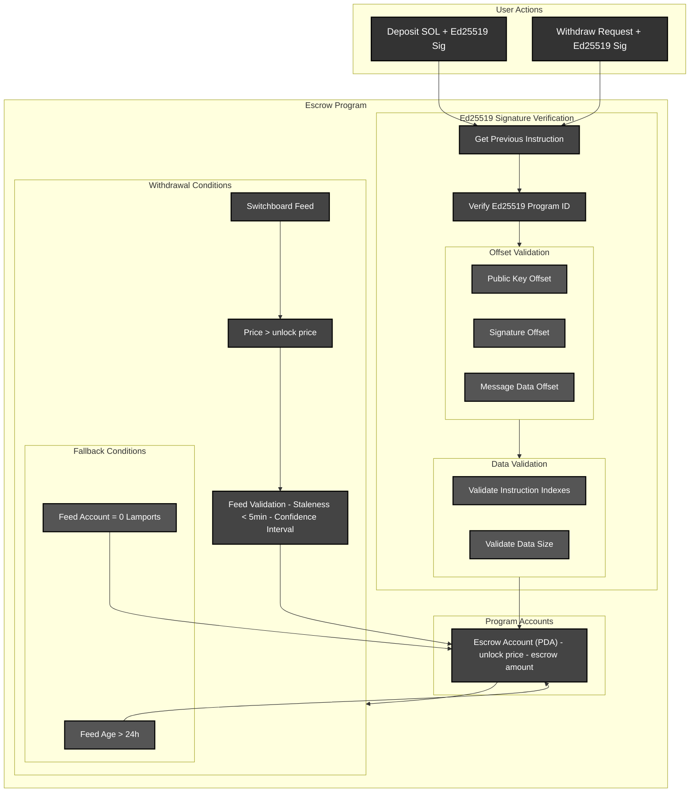

# Solana Program: Unlocking a Vault Based on SOL Price and Signature Verification
This Solana escrow program allows users to withdraw funds only when the SOL price reaches a certain target and after verifying their Ed25519 signature.
## Ed25519 Signature Verification
In Solana, programs cannot directly call the Ed25519 program using a CPI (Cross-Program Invocation) because signature verification is computationally expensive. Instead, the Ed25519 signature verification program exists as a precompiled instruction outside the Solana Virtual Machine (SVM).
we do verification by passing two instructions one [Ed25519 program](https://github.com/anza-xyz/agave/blob/master/sdk/ed25519-program/src/lib.rs) ix and second our custom logic ix (it mush have a sysvar ix to get current chain state)

The sysvar instructions account provides access to all instructions within the same transaction.
This allows our program to fetch and verify the arguments passed to the Ed25519 program, ensuring they were correctly signed before unlocking funds.
# Vault Unlock Conditions
The SOL price must meet or exceed the target threshold & Ed25519 signature must be verified
# Vault Architecture

